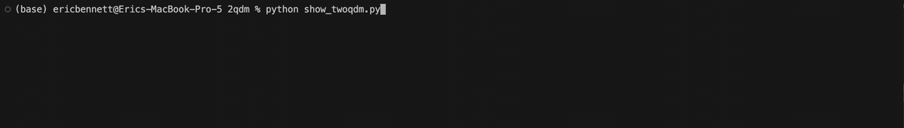

# twoqdm

`twoqdm` is a small `tqdm` wrapper for long-running Python loops. It keeps
the normal progress bar and adds a live terminal panel with recent `it/s`
history, colored trend direction, jitter, and a smarter ETA hint.

## Demo



## Install

```bash
python3 -m pip install twoqdm
```

For local development from this repository:

```bash
python3 -m pip install -e ".[dev]"
```

## Use

```python
from twoqdm import tqdm, trange

for record in tqdm(records, desc="processing"):
    process(record)

for i in trange(500, desc="training"):
    train_step(i)
```

Disable color output with:

```bash
TQDM_TREND_NO_COLOR=1 python3 your_script.py
```

## Build

```bash
python3 -m pytest
python3 -m build
python3 -m twine check dist/*
```

## Publish

Create a PyPI API token, then upload:

```bash
python3 -m twine upload dist/*
```

PyPI does not allow re-uploading the same version. Bump the version in
`pyproject.toml` and `src/twoqdm/__init__.py` before publishing a new release.
